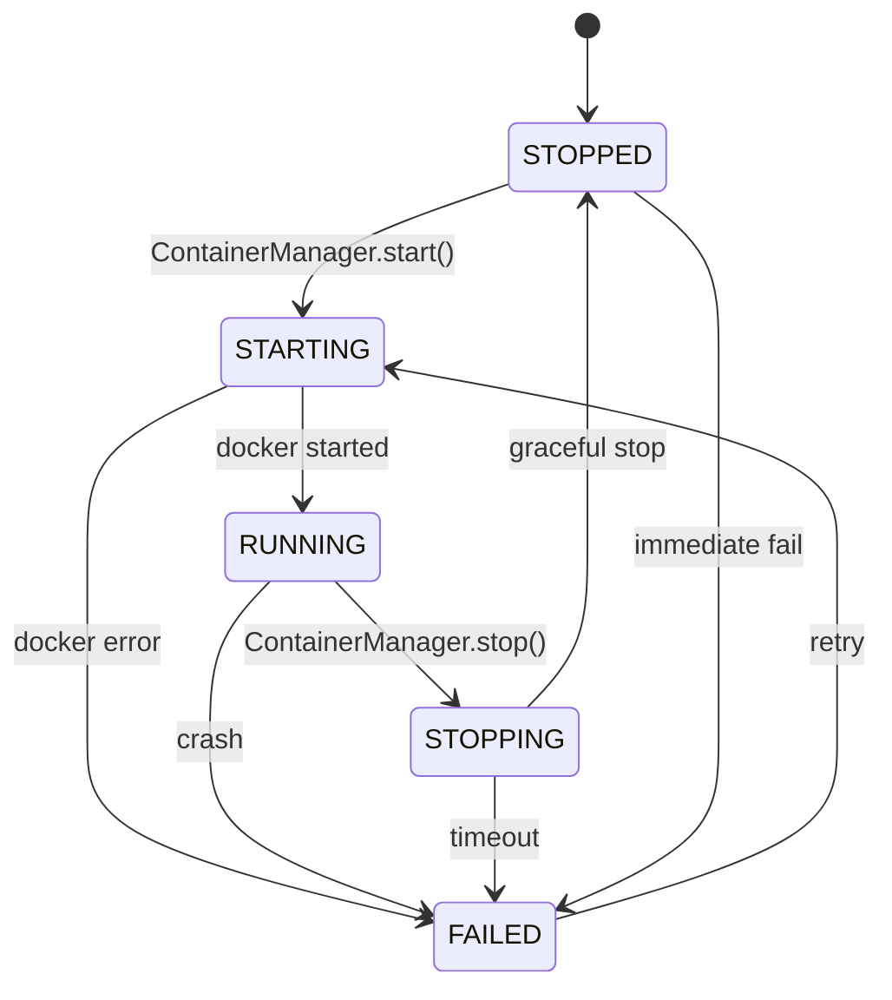

Based on my thorough analysis of the codebase, here's a comprehensive architectural analysis of the **llms-gateway** system for rolling new LLMs at runtime.

---

## 🏗️ Architecture Overview: Dynamic Per-Capability Container Model

```mermaid
graph TB
    Client[Client / App] -->|port 6060| Nginx[Nginx Reverse Proxy<br/>modelctl-nginx]
    
    Nginx -->|/v1/chat/completions| Chat[modelctl-chat:8080<br/>llama-server]
    Nginx -->|/v1/tool-calling/completions| ToolCalling[modelctl-tool-calling:8080<br/>llama-server]
    Nginx -->|/v1/embeddings| Embed[modelctl-embedding:8080<br/>llama-server]
    Nginx -->|/v1/rerank| Rerank[modelctl-reranker:8080<br/>llama-server]
    Nginx -->|/v1/vision| Vision[modelctl-vision:8080<br/>llama-server]
    Nginx -->|/v1/experimental| Exp[modelctl-experimental:8080<br/>llama-server]
    Nginx -->|/ (management API + SPA)| API[llama-server:8000<br/>modelctl-api + SvelteKit UI]
    
    API -->|Docker SDK<br/>via /var/run/docker.sock| Docker[Docker Daemon]
    Docker -->|spawns siblings| Chat
    Docker -->|spawns siblings| Embed
    
    subgraph modelctl-net
        Chat
        Embed
        Rerank
        Vision
        Exp
        API
    end

    API -->|reads/writes| Registry[(Registry JSON/SQLite<br/>models.json, active.json)]
    
    subgraph HuggingFace
        HF[(HuggingFace Hub)]
    end
    
    API -.->|downloads .gguf| HF
```

---

## 🔄 Full Lifecycle of Rolling a New LLM at Runtime

The system supports a **two-phase flow** — install → serve:

### Phase 1: Install a Model via REST API

| Step | Action | What Happens |
|------|--------|-------------|
| 1 | `POST /api/v1/models/install` `{repo_id, filename}` | Client requests a model from HuggingFace |
| 2 | `huggingface.inspect()` | Synchronous API call to HF to verify repo + list `.gguf` files |
| 3 | `registry.add_model(status="downloading")` | Model registered instantly in models.json |
| 4 | **Returns 202** with model ID | Client gets immediate response |
| 5 | Background **daemon thread** | Downloads `.gguf` in 8KB chunks via streaming HTTP |
| 6 | `validator.validate_file()` | Checks SHA-256, file size, GGUF magic bytes (`\x47\x47\x55\x46`) |
| 7 | `registry.update_model(status="installed")` | Model ready for serving |

### Phase 2: Spin Up a Container at Runtime

| Step | Action | What Happens |
|------|--------|-------------|
| 1 | `POST /api/v1/containers` `{capability, model_id}` | Client requests serving |
| 2 | `registry.find_model(model_id)` | Resolves model + finds its GGUF artifact path |
| 3 | `ContainerManager._stop_by_name()` | **Stops any existing container** for same capability (hot-swap) |
| 4 | `docker.containers.run()` | Spawns new sibling container on `modelctl-net`: |
| | | - Image: `ghcr.io/ggml-org/llama.cpp:server` |
| | | - Name: `modelctl-{capability}` |
| | | - Command: `/app/llama-server -m {model.gguf} --host 0.0.0.0 --port 8080` |
| | | - **No host ports exposed** — internal network only |
| | | - Storage mounted read-only at storage |
| | | - GPU auto-detected (NVIDIA runtime check + `nvidia-smi` fallback) |
| 5 | Returns **201** with `ContainerInfo` | Client has container ID |
| 6 | **Nginx automatically routes** to new container | DNS resolves `modelctl-{cap}` via Docker's embedded DNS (`127.0.0.11`) |

---

## 🧱 Key Components & Their Responsibilities

### 1. `modelctl-core` — The Foundation Library
📁 modelctl_core

| File | Role |
|------|------|
| models.py | Domain dataclasses: `Model`, `Artifact`, `Download` with **state machine** (`registered → downloading → installed → active → error`) |
| `store.py` | Abstract `RegistryStore` — CRUD for models, downloads, active state. **Hot-swap logic**: `set_active()` displaces any previously active model of the same type |
| `json_store.py` / `sqlite_store.py` | Two backends — JSON files (human-readable) or SQLite (concurrent-safe), selected via `MODELCTL_STORE_BACKEND` |
| `huggingface.py` | HuggingFace Hub integration — `search()`, `inspect()`, `download_file()`, and automatic **type inference** from `pipeline_tag` (`text-generation` → `chat`, `sentence-similarity` → `embedding`, etc.) |
| `validator.py` | File integrity: SHA-256 hash + GGUF magic bytes check |
| registry.py | Unified module-level proxy — the single import used by API and CLI |

### 2. `modelctl-orch` — The Container Orchestrator
📁 modelctl_orch

| File | Role |
|------|------|
| container_manager.py | **The heart of runtime rolling** — `ContainerManager` class wraps Docker SDK. Key methods: `start()` (spawns container, auto-stops existing), `stop()`, `list()`, `inspect()`, `logs()`, `restart()`, `wait_for_healthy()` (polls `/health` up to 30s) |
| lifecycle.py | Formal **state machine**: `STOPPED → STARTING → RUNNING → STOPPING → STOPPED`, with `FAILED → STARTING` retry path |
| port_allocator.py | **Simplified to zero port conflicts** — all containers use internal port 8080, no host ports needed |

### 3. `modelctl-api` — The Management API
📁 modelctl_api

| Layer | Details |
|-------|---------|
| main.py | FastAPI factory with `lifespan` context manager. Initializes all 4 services at startup. CORS all origins. Custom exception handlers mapping domain errors → HTTP codes |
| `config.py` | Pydantic `Settings` with `MODELCTL_API_` prefix — image name, Docker network, timeouts |
| `services/model_service.py` | `ModelService` — `list_models()`, `get_model()`, `install_model()` (returns 202 + background thread), `remove_model()` |
| `services/container_service.py` | `ContainerService` — bridges API to `ContainerManager`. Resolves model path from registry, creates `ResourceProfile`, delegates Docker operations |
| `routers/containers.py` | 6 REST endpoints: `GET/POST /containers`, `GET/DELETE /containers/{id}`, `POST /containers/{id}/restart`, `GET /containers/{id}/logs` |
| `routers/models.py` | 5 REST endpoints: `GET /models`, `GET/POST/DELETE /models/{id}`, `GET /models/{id}/progress` |

### 4. Nginx — The Traffic Router
📄 nginx.conf

Routes by URL path to container **names** on `modelctl-net`. Uses `resolver 127.0.0.11 valid=10s` so upstreams resolve dynamically as containers come and go. Chat completions get SSE streaming support (`proxy_buffering off`).

### 5. docker-compose.yml — Deployment
Two services on `modelctl-net`:
- **`nginx`** — entry point on `${NGINX_PORT:-6060}`, routes to per-capability containers
- **`llama-server`** — runs `modelctl-api` + has Docker socket mounted for spawning sibling containers

---

## 🔄 Container State Machine



---

## 🎯 Key Architectural Decisions

1. **No host port conflicts.** All inference containers use port `8080` internally. Nginx routes by container **name** via Docker's embedded DNS resolver. This eliminated the previous port scanning approach entirely.

2. **Hot-swap by design.** When `start()` is called for a capability that already has a running container, `_stop_by_name()` gracefully stops the old one (`stop(timeout=10)` + `remove()`) before spawning the new one. Downstream Nginx picks up the new container once Docker DNS propagates (10s TTL).

3. **Sibling container pattern.** The `modelctl-api` container (actually named `llama-server` in docker-compose) mounts the Docker socket, allowing it to spawn **sibling** containers on the same `modelctl-net` network. Classic "Docker-out-of-Docker" (DooD).

4. **Background async install.** Model downloads happen in a daemon thread with throttled progress updates (500ms), so the API can serve other requests during multi-GB downloads. The `GET /models/{id}/progress` endpoint lets clients poll download percentage.

5. **Capability-tuned profiles.** Chat/vision get 8GB RAM + 4 CPUs; embedding gets 2GB/2CPUs with `--embeddings --pooling last` flags; reranker/experimental get 4GB/2CPUs. All configurable per-request via `ResourceProfile` overrides.

6. **Dual persistence backends.** JSON files for development (human-readable) and SQLite for production (safe concurrent access). Switch via `MODELCTL_STORE_BACKEND=sqlite`.

7. **GPU auto-detection.** Checks Docker NVIDIA runtime → falls back to `nvidia-smi` → falls back gracefully to CPU.

---

## 📋 Current State

The registry currently has **3 installed models**:

| Model | Type | Size | Status |
|-------|------|------|--------|
| `nomic-embed-text-v1.5-GGUF` | embedding | 84 MB | ✅ installed |
| `functiongemma-270m-it-GGUF` | chat | 253 MB | ✅ installed |
| `gemma-4-E2B-it-GGUF` | experimental | 3.1 GB | ✅ installed |

No containers are currently active (`active.json` is empty) — they'll be spun up on demand when `POST /api/v1/containers` is called.

---

## 🚀 How to Roll a New LLM Right Now

```bash
# 1. Search HuggingFace
curl localhost:6060/api/v1/search?q=llama-3.2

# 2. Inspect a repo to see available GGUF files
curl localhost:6060/api/v1/search/inspect?repo_id=meta-llama/Llama-3.2-1B

# 3. Install (downloads in background)
curl -X POST localhost:6060/api/v1/models/install \
  -H 'Content-Type: application/json' \
  -d '{"repo_id":"meta-llama/Llama-3.2-1B-GGUF","filename":"llama-3.2-1b-q4_k_m.gguf"}'

# 4. Spin up a serving container (replaces any existing chat container)
curl -X POST localhost:6060/api/v1/containers \
  -H 'Content-Type: application/json' \
  -d '{"capability":"chat","model_id":"llama-3.2-1b-gguf"}'

# 5. Inference flows through Nginx automatically
curl -X POST localhost:6060/v1/chat/completions \
  -H 'Content-Type: application/json' \
  -d '{"model":"llama-3.2-1b-gguf","messages":[{"role":"user","content":"Hello!"}]}'
```